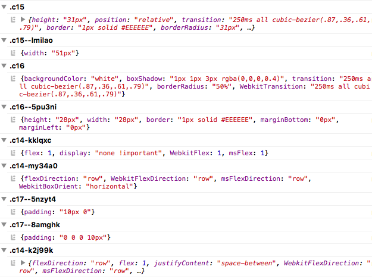

# alef-logger

 

Logging tool for Alef. Logs changes to the console, grouped by selector, animation name or font family.

## Installation
```sh
yarn add alef-logger
```
You may alternatively use `npm i --save alef-logger`.

## Usage
```javascript
import { createRenderer } from 'alef'
import logger from 'alef-logger'

const renderer = createRenderer({
  enhancers: [ logger() ]
})
```
### Configuration
##### Options
| Option | Value | Default | Description |
| --- | --- | --- | --- |
| `logCSS` | *(boolean)* | `false` | logs rendered CSS string |
| `formatCSS` | *(boolean)* | `false` |  logs formatted CSS strings<br>only together with `logCSS: true` |

##### Example
```javascript
import { createRenderer } from 'alef'
import logger from 'alef-logger'

const loggerEnhancer = logger({
  logCSS: true,
  formatCSS: true
})

const renderer = createRenderer({
  enhancers: [ loggerEnhancer ]
})
```

## Example


## License
Alef is licensed under the [MIT License](http://opensource.org/licenses/MIT).<br>
Documentation is licensed under [Creative Common License](http://creativecommons.org/licenses/by/4.0/).<br>
Created with ♥ by [@rofrischmann](http://rofrischmann.de) and all the great contributors.
